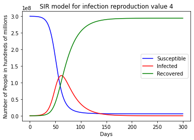

# "Flattening the Curve": _How to stop the spread of infectious diseases such as the coronavirus_ 
_Visualization of the coronavirus "flattening of the curve" based on the SIR model of disease spread 
used in the study of epidemiology. Coded in Python using pyplot and numpy._

#### Author: Nathan Rice

---

# Overview
The R0 value, or reproduction value, in the SIR model is a measure of the reproduction rate of the 
disease. The lower the R0 value, the less the disease is able to spread and infect people. We can think 
of preventative measures of disease spread such as social distancing, wearing a mask, and staying at 
home as representing a low R0 value. In this way we can see the effectiveness of preventative measures 
on reducing the maximum number of people infected and slowing the rate of infection.

# Visualization

A reproduction value of 1.7 could represent a situation where everyone always takes every preventative 
measure they can such as social distancing, wearing a mask, staying at home, and washing hands.

   

A reproduction value of 4 could represent people taking some preventative measures like wearing a mask 
and washing hands.

   

A reproduction value of 10 represents a society where few people take preventative measures.

   

